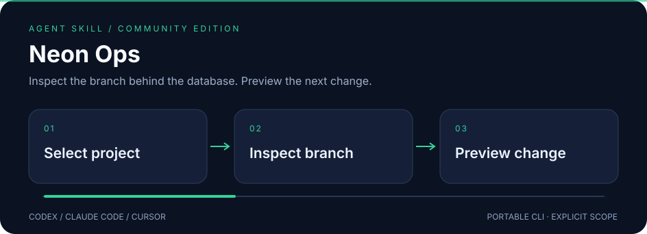

# Neon Ops

**Inspect the branch behind the database. Preview the next change.**



A standalone skill for **Codex · Claude Code · Cursor**, backed by a portable Python CLI.
Independent community project; not affiliated with or endorsed by the provider.

## ✨ What it does

- Follow project → branch → database/role relationships with explicit IDs.
- Validate organization API keys through projects without depending on a personal users/me endpoint.
- Preview API writes without credentials or network access; redact connection strings and credential fields in responses.

## 🚀 Install

Requires Node.js **22.20+** for the tested skills installer.

```sh
npx skills@1.7.1 add joeeeeey/neon-ops --agent codex claude-code cursor --yes
```

The implementation is initially delivered in a pull request. Until that PR is merged,
reviewers can install the branch with:

```sh
npx skills@1.7.1 add https://github.com/joeeeeey/neon-ops/tree/feat/standalone-skill --agent codex claude-code cursor --yes
```

Then ask your agent to use **neon-ops**. The standard SKILL.md and bundled CLI are the
portable interface; no dependency on another personal skill is needed.

## 🔎 Try it

From the installed skill directory, or a repository checkout:

```sh
python3 scripts/neon_api.py projects --summary
python3 scripts/neon_api.py branches --project-id PROJECT_ID --summary
python3 scripts/neon_api.py delete /projects/PROJECT_ID/branches/BRANCH_ID
```

Python 3.10+. `NEON_API_KEY` or an explicit `NEON_API_KEY_FILE` (private regular file). No default team or organization, no account-specific token discovery.

Run `python3 scripts/neon_api.py --help` for all commands.
Use a secret manager or a private local file for credentials; avoid pasting values into shell history.

## How to use it well

Confirm the project and branch from read results. Check endpoint state and operation status before diagnosis. For user-requested writes, load an exact JSON body from a private file, preview, and add `--execute` only after authorization. Inspect returned operations to determine completion; an accepted API response is not proof of database readiness.

## 🧪 Compatibility and verification

| Layer | Scope |
| --- | --- |
| Runtime | Python 3.10+; dependency-free standard library helpers |
| Agent interface | Standard SKILL.md + relative scripts; Codex, Claude Code, Cursor |
| Offline verification | Synthetic fixtures and mocks; run `python3 -m unittest discover -s tests -v` |
| Installation / native execution | See [validation evidence](references/validation.md) for exact tested levels |
| Live account operations | Not exercised as part of this release |

The illustration uses declarative SVG animation, with a readable static state and reduced-motion
fallback. It contains no JavaScript, external font or remote image dependencies.

## Limits and data handling

Management API only: no SQL execution or secret retrieval workflow. Generic API mutations are an escape hatch, not schema validation. Lists expose a single response page; use --param and provider pagination. Connection credentials are redacted and not recoverable through this CLI.

Secret-like fields and configured credential values are redacted where supported. Ordinary
resource names, logs and account metadata may still be private: review output before sharing.

[Official documentation and API notes](references/api.md) · [MIT license](LICENSE)

## Provenance

Extracted and maintained from the author's existing local skill implementation, with
account-specific defaults and private operational notes removed. Documentation, fixtures and
SVG artwork in this distribution are original. External runtimes and provider services retain
their own licenses and terms; this repository does not redistribute them.
